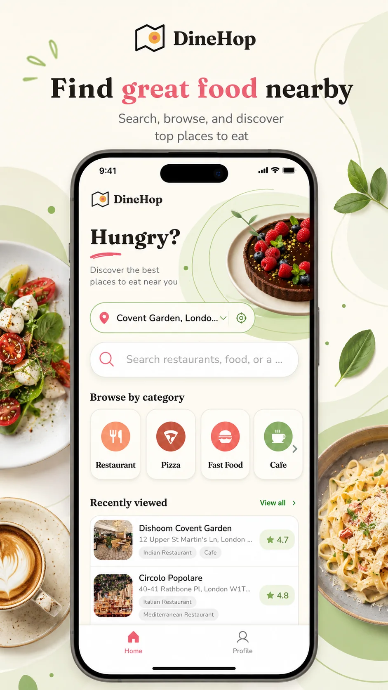
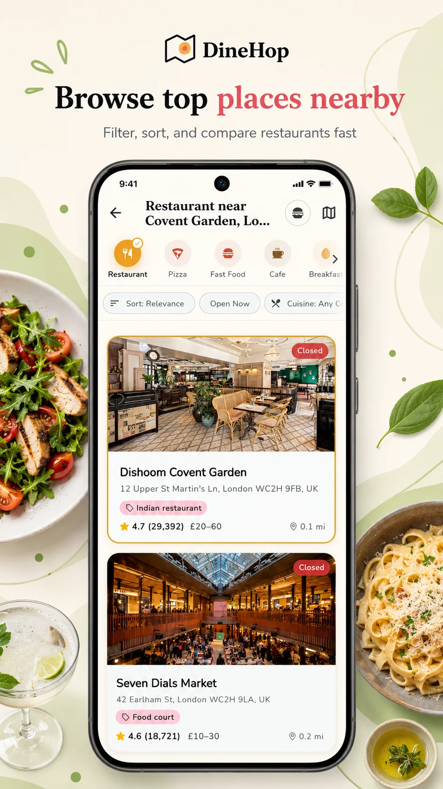
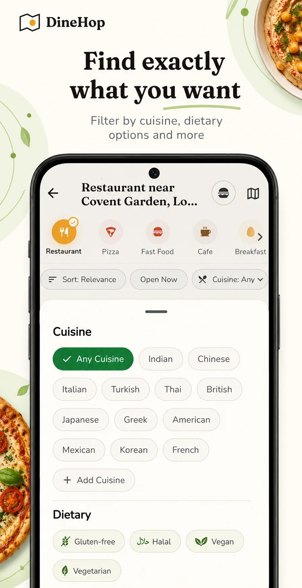
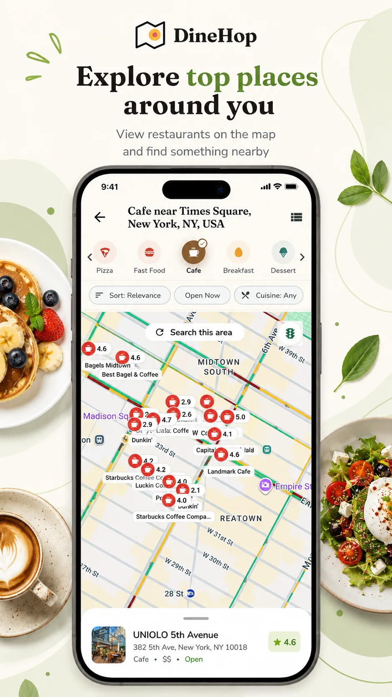
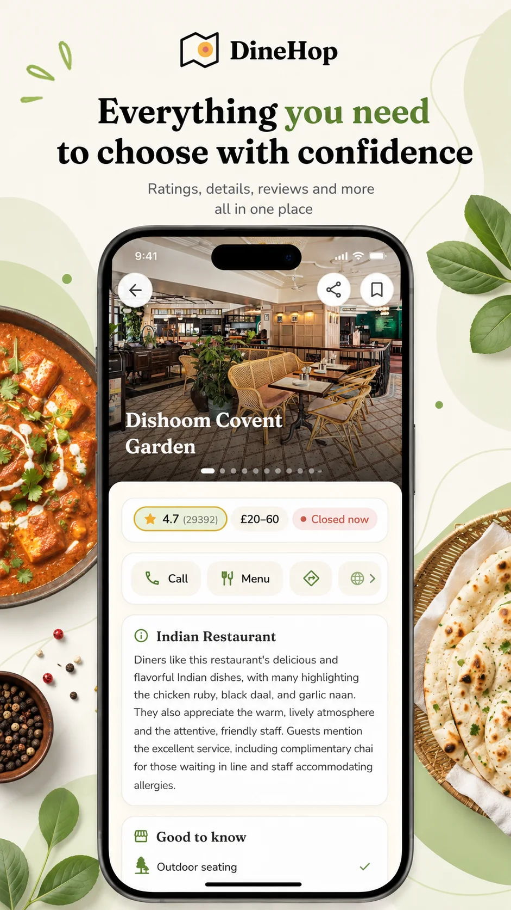
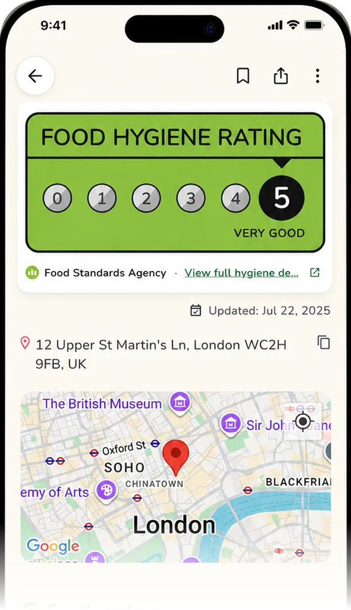

  

<h1 align="center">DineHop Restaurant Finder</h1>

  DineHop is a restaurant discovery and night-out planning app. Search by dish,
  cuisine or area, compare the information that matters, and organise several
  places into one plan.

  <a href="https://dinehop.app">Official website</a> ·
  <a href="https://play.google.com/store/apps/details?id=restaurant.app">Download on Google Play</a> ·
  <a href="docs/product-facts.md">Product facts</a> ·
  <a href="docs/media-kit.md">Media kit</a>

## Product status

- **Android:** Available on [Google Play](https://play.google.com/store/apps/details?id=restaurant.app).
- **iOS:** Under development. No public release date has been announced.
- **Price:** Free to use, supported by advertising. There is no subscription.
- **Coverage:** Restaurant search works worldwide. Some data, including official food-hygiene ratings, depends on local availability.

## What DineHop does

- Searches for restaurants by dish, cuisine, neighbourhood, postcode or area.
- Browses nearby restaurants, cafes, bars and other food categories.
- Compares menus, opening hours, prices, photos, ratings and reviews.
- Filters results by cuisine, area, dietary needs, budget, rating and whether a place is open.
- Shows official food-hygiene or inspection ratings in supported jurisdictions.
- Saves places with private notes and makes saved places searchable.
- Groups several venues into a named multi-stop plan called a **Hop**.
- Opens directions, phone numbers, websites and menu links supplied for a venue.

Basic search and browsing do not require an account. An account is used for features that save or publish personal content, including synced saved places and community reviews.

## Product screens

The images below show representative DineHop screens. Restaurant details and other third-party information can change over time.

| Search | Results | Filters |
| --- | --- | --- |
|  |  |  |

| Map | Place details | Hygiene rating |
| --- | --- | --- |
|  |  |  |

## Food-hygiene information

DineHop currently supports official food-hygiene or inspection data in eight countries. Coverage is country-wide in six countries and limited to named cities in the United States and Canada.

| Country | Current coverage | Official scheme or data source |
| --- | --- | --- |
| United Kingdom | Country-wide where published records are available | Food Standards Agency FHRS and Scottish FHIS records |
| France | Country-wide | Alim'confiance |
| Singapore | Country-wide | Singapore Food Agency grades |
| Finland | Country-wide | Oiva |
| Denmark | Country-wide | Danish Smiley scheme |
| Norway | Country-wide | Smilefjes |
| United States | New York City, Chicago and Austin only | NYC restaurant grades, Chicago Food Inspections and Austin Public Health scores |
| Canada | Toronto only | DineSafe |

The source and update date are shown with the rating. DineHop does not create or independently inspect venues. See [product facts](docs/product-facts.md) for the current coverage statement.

## For developers and technical readers

The mobile client is developed with Flutter for Android and iOS. This repository is the official public information and media repository for the product. It does not contain the application source code and is not an open-source distribution.

Public API documentation, integration examples or open datasets may be added here or linked from here if DineHop releases them in the future.

## Official resources

- [DineHop official website](https://dinehop.app)
- [DineHop on Google Play](https://play.google.com/store/apps/details?id=restaurant.app)
- [Privacy Policy](https://dinehop.app/privacy)
- [Terms of Use](https://dinehop.app/terms)
- [Community Guidelines](https://dinehop.app/guidelines)
- [Delete a DineHop account](https://dinehop.app/delete-account)
- [Support](SUPPORT.md)
- [Security reporting](SECURITY.md)
- [Brand and media assets](docs/brand-assets.md)

## Service boundaries

DineHop helps people discover and organise places to eat. It does not currently provide table bookings or food delivery. Restaurant information comes from third-party and official sources and may not always be complete or current.

## Contact

Product support, media enquiries and responsible security reports can be sent to [contact@dinehop.app](mailto:contact@dinehop.app). Please use the guidance in [SUPPORT.md](SUPPORT.md) or [SECURITY.md](SECURITY.md) when relevant.
